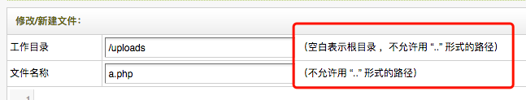
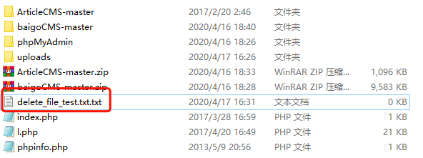
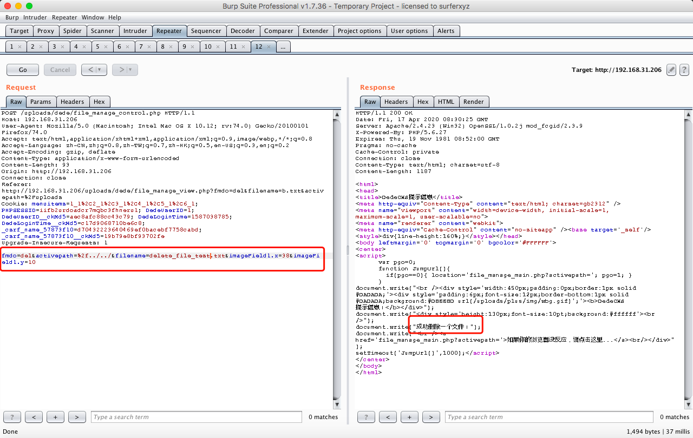
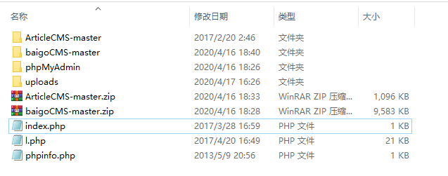

**Brief of this vulnerability**

DedeCMS 5.7 SP2 allowed to deleted the files that are able to delete files outside the constraints of the current project, such as files in some parent directories or files in some system roots.There is no limit to the file directory that `unlink` can execute.

**Test Environment**

* Apache/2.4.18 
* PHP 5.6.40+ubuntu16.04

**Affect version**

DedeCMS 5.7 SP2 


**Vulnerable Code**

`dede/file_class.php`

```
function DeleteFile($filename)
    {
        $filename = $this->baseDir.$this->activeDir."/$filename";
        if(is_file($filename))
        {
            @unlink($filename); $t="文件";
        }
        else
        {
            $t = "目录";
            if($this->allowDeleteDir==1)
            {
                $this->RmDirFiles($filename);
            } else
            {
                // 完善用户体验，by:sumic
                ShowMsg("系统禁止删除".$t."！","file_manage_main.php?activepath=".$this->activeDir);
                exit;
            }
            
        }
        ShowMsg("成功删除一个".$t."！","file_manage_main.php?activepath=".$this->activeDir);
        return 0;
    }
```

Without filtering and judging the path range of filename, use filename directly.

And in this place, The author consciously checked `../`, but did not check at the exploit point `../`



**Vulnerability display**

Outside of this project, I created a test file for deletion.



Implementation of exp



File deleted



**Fix suggestion**

Filter `../` or restrict the executable directory permission of `unlink`