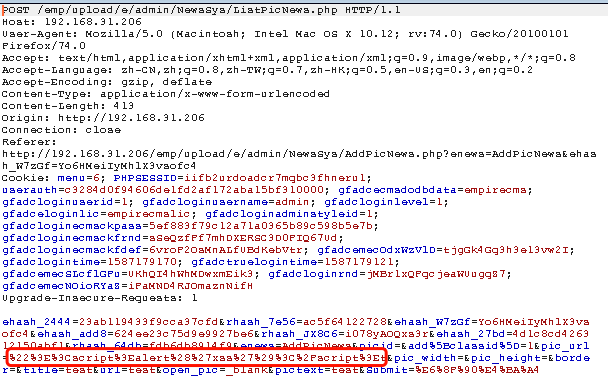

**Brief of this vulnerability**

EmpireCMS_7.5  allows closed links to construct storage type XSS when constructing picture URLs.

**Test Environment**

* Apache/2.4.18 
* PHP 5.6.40+ubuntu16.04

**Affect version**

EmpireCMS 7.5 

**Vulnerable Code**

`e/admin/NewsSys/ListPicNews.php`

```
$pic_url=hRepPostStr2($pic_url);
```

`e/class/connect.php`

```
function hRepPostStr2($val,$phck=0){
	if($phck==1)
	{
		CkPostStrCharYh($val);
	}
	CkPostStrChar($val);
	$val=AddAddsData($val);
	return $val;
}
```

```
function AddAddsData($data){
	if(!MAGIC_QUOTES_GPC)
	{
		$data=addslashes($data);
	}
	return $data;
}
```

Only use `addslashes`  to filter single quotation  ('), double quotation  ('), backslash (\), null, and no other HTML symbols such as `script`, `<` are detected.

**Vulnerability display**

submit poc



trigger xss


**Fix suggestion**

Filter key word `scirpt` and other html tag or symbol.